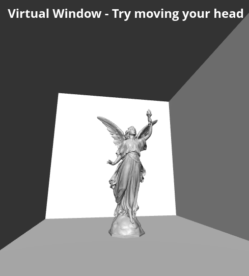

# Virtual Window

This project was inspired by a cool [blog post](https://charliegerard.dev/blog/interactive-frame-head-tracking/).

## How?

We train a head-tracking model in [PyTorch](http://pytorch.org/), then export this to ONNX and use ONNX.js to detect the head position.
We use the head position relative to the camera to update the camera projection matrix of the scene of the window.
Alternatively, we could update the camera position, but I don't want to be estimating head depth at the moment.

## License

Lucy model adapted from [Princeton Suggestive Contour Gallery
](https://gfx.cs.princeton.edu/proj/sugcon/models/), originally from [Stanford 3D scanning respository](https://graphics.stanford.edu/data/3Dscanrep/).

[MIT](./LICENSE)
